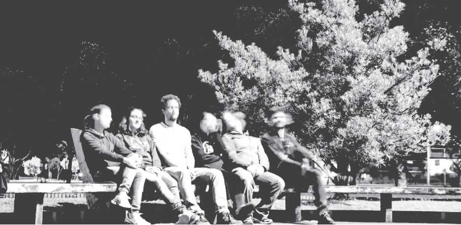
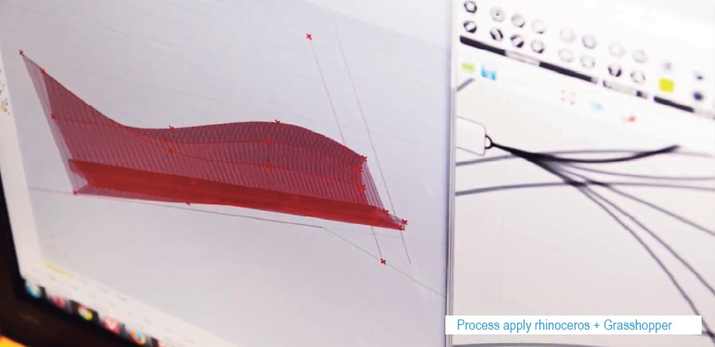
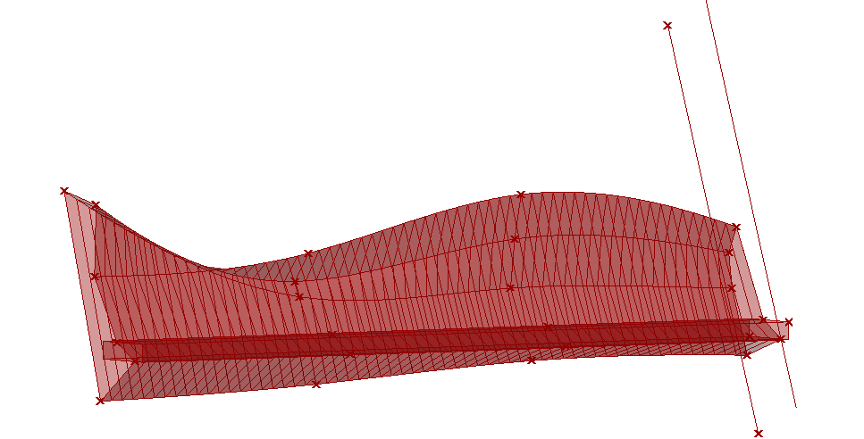
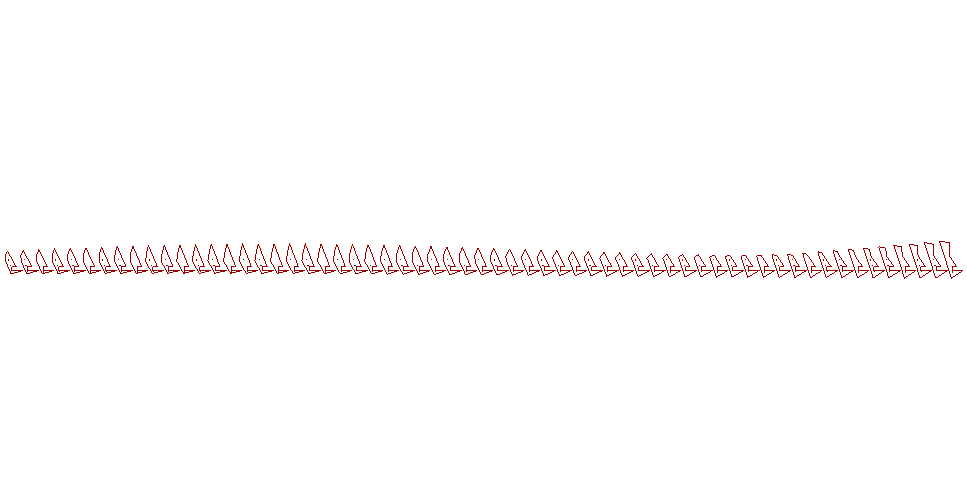
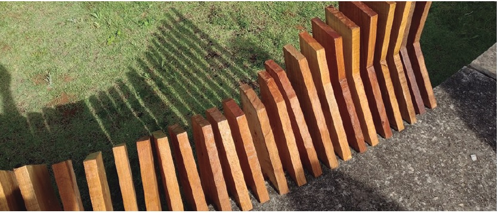

# addendum_for_bench

Addendum module for bench

The first Parametric Architecture Workshop was offered in the first half of 2015 by the Department of Architecture and Urbanism in partnership with professor and architect Rafael Lemieszek Pinheiro.

During the course, aspects of open architecture and participation of the ouropretana community were discussed. In step 1.0 and 1.5 questions were raised to be addressed in the following projects. The experimental project was a bench applique, used in the Open Campus event.

See the video on [youtube](https://youtu.be/2uLZlsZJpYM).

## Coordination

Rafael Lemieszek Pinheiro

## Students

Adriely Pechutti

Cínthia Reis

Renata Ito

Renato G. Cruz

Tales Capute

## Woodwork

Carlos Cocó

João 106

Generoso

Edson

Carlos Bico

Márcio

Daniel

Cláudio

Wando

Caesar

Jonathan

Alexandre
